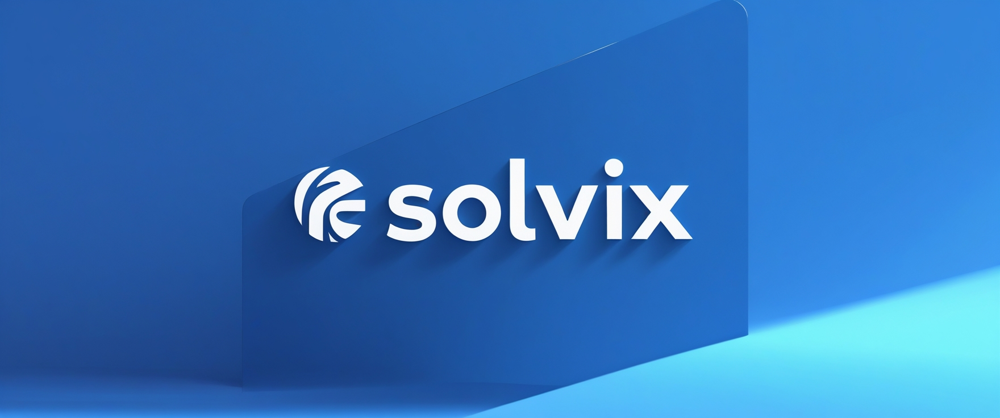

# **Solvix – Real-World Asset Tokenization on Solana**

## **Overview**
Solvix is a cutting-edge blockchain platform that enables the tokenization of real-world assets (RWA) on the **Solana** blockchain. Whether it's **real estate, commodities, financial securities, or intellectual property**, Solvix provides a **secure, efficient, and fully compliant** infrastructure to tokenize, trade, and manage real-world assets in a decentralized manner.

## **Key Features**
✅ **Tokenize Any Real-World Asset** – Convert assets into digital tokens with built-in compliance.

✅ **Fast & Low-Cost Transactions** – Powered by **Solana’s high-speed, low-fee network**.

✅ **Fractional Ownership** – Lower barriers to asset investments for global participation.

✅ **Decentralized Trading** – Buy, sell, and stake RWA-backed tokens with instant liquidity.

✅ **Compliant & Secure** – Integrated **KYC/AML** and automated smart contract governance.

## **How It Works**
Solvix provides a seamless experience for users to tokenize and trade assets through its **web and mobile applications**. The entire process is managed within our platform, eliminating the need for external coding or technical expertise.

### **Step 1: Sign Up & Verify Your Identity**
- Create an account on the **Solvix Web App** or **Mobile App** (available in March 2025).
- Complete KYC/AML verification for secure transactions.
- Connect your Solana-compatible wallet.

### **Step 2: Tokenize Your Asset**
- Submit asset details for verification.
- Our platform ensures legal compliance before minting digital tokens.
- Receive **SVX tokens**, representing ownership or claims to the asset.

### **Step 3: Trade & Invest in Tokenized Assets**
- Browse available tokenized assets on the **Solvix Marketplace**.
- Buy, sell, or stake fractional ownership of RWAs.
- Earn passive income from rental yields, dividends, or staking rewards.

### **Step 4: Manage & Withdraw**
- Track your portfolio via the **Solvix Web & Mobile App**.
- Withdraw funds or redeem your tokens for real-world value.
- Utilize DeFi integrations for lending, staking, and liquidity pools.

## **Roadmap**
### **March 2025 – Launch of Solvix Web & Mobile Apps**
- **Solvix Web App** for tokenization, trading, and staking
- **Solvix Mobile App (iOS & Android)** for on-the-go asset management
- **DEX Integration** for decentralized RWA trading

### **Q2 2025 – Institutional Expansion**
- **Alpha Launch** - Smart contract development, legal structuring, MVP launch
- **Testnet Deployment** - Testnet launch with early adopters, compliance audits

### **Q3 2025 – Mainnet**
- **Mainnet Launch** - Full-scale deployment, partnerships with financial institutions

### **Q4 2025 - Floor**
- **DEX & Staking Launch** - Solvix marketplace integration, staking rewards activation
- **Expansion** - Onboarding real estate firms, commodities traders, global scaling

### **2026+**
- **Institutional Adoption** - Expansion into enterprise-grade RWA tokenization and regulatory integration

## **Security & Compliance**
Solvix is committed to regulatory compliance, integrating **KYC/AML verification, legal wrappers, and jurisdictional approvals** to ensure **global adherence** to financial laws.

## **Stay Connected**
🌐 **Website:** [www.solvix.finance](https://www.solvix.finance)

📢 **Twitter:** [@SolvixFinance](https://www.x.com/solvixfinance)

📧 **Contact:** info@solvix.finance

Your assets. Your future. **Tokenized with Solvix.**
